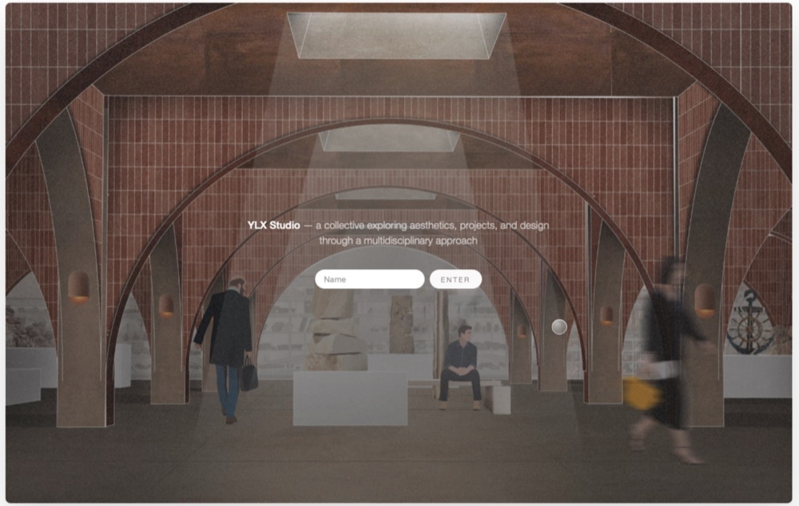

# YLX Studio Portfolio

An interactive architecture and design portfolio for YLX Studio, built around immersive motion, scroll-based storytelling, project case studies, drawings, and a visual archive of academic and spatial design work.



## Highlights

- Single-page portfolio experience with section-based navigation
- GSAP-driven intro choreography, hero transitions, and scroll-linked motion
- Lenis smooth scrolling with custom wheel and touch gating for the hero flow
- Data-driven project grid rendered from `scripts/mineport-project-data.js`
- Project detail overlay with progressive image loading and blurred previews
- Drawing archive with generated cards and full-screen detail viewing
- Responsive desktop and mobile behavior, including reduced-motion support

## Built with

- Semantic HTML and component-scoped CSS
- JavaScript ES modules
- [Vite](https://vite.dev/)
- [GSAP](https://gsap.com/)
- [Lenis](https://lenis.darkroom.engineering/)

## Local Development

This project uses Node.js and Vite.

```bash
npm ci
npm run dev
```

The local development server runs on:

```text
http://localhost:8000
```

Create and inspect a production build:

```bash
npm run build
npm run preview
```

## Content Workflow

Project content is managed from one source of truth:

```text
scripts/mineport-project-data.js
```

After adding or changing project images, generate missing blurred previews:

```bash
npm run previews
```

Validate project data, image paths, previews, and filter coverage:

```bash
npm run check-data
```

## Deployment

The production build command is:

```bash
npm run build
```

The generated output directory is:

```text
dist
```

The site can be deployed as a static Vite build. For Netlify, `public/_redirects` is copied into `dist/_redirects` during build so refreshed section or client-side URLs resolve back to `index.html`.

The repository also includes a GitHub Pages workflow in `.github/workflows/deploy.yml`, where `VITE_BASE` is set for project-page deployment.

## Project Structure

```text
.
├── index.html                    # Page structure, metadata, and Vite entry point
├── vite.config.mjs               # Vite base URL, dev server, and build output config
├── scripts/
│   ├── main.js                   # Initializes all components
│   ├── core/                     # Shared animation, scroll, state, data, and utilities
│   ├── components/               # UI sections and interaction modules
│   ├── mineport-project-data.js  # Published and unpublished project data
│   ├── check-data.js             # Project data and asset validation
│   └── generate-previews.js      # Blurred preview image generator
├── styles/
│   ├── base.css                  # Reset, tokens, and global styles
│   └── components/               # Component-specific stylesheets
├── public/
│   ├── _redirects                # Netlify SPA fallback
│   └── assets/                   # Images, previews, icons, and static media
└── package.json                  # Scripts and dependencies
```

## Rights

© 2026 YLX Studio. All rights reserved. The source is published for portfolio review; the visual work, media, and written content are not licensed for reuse.
